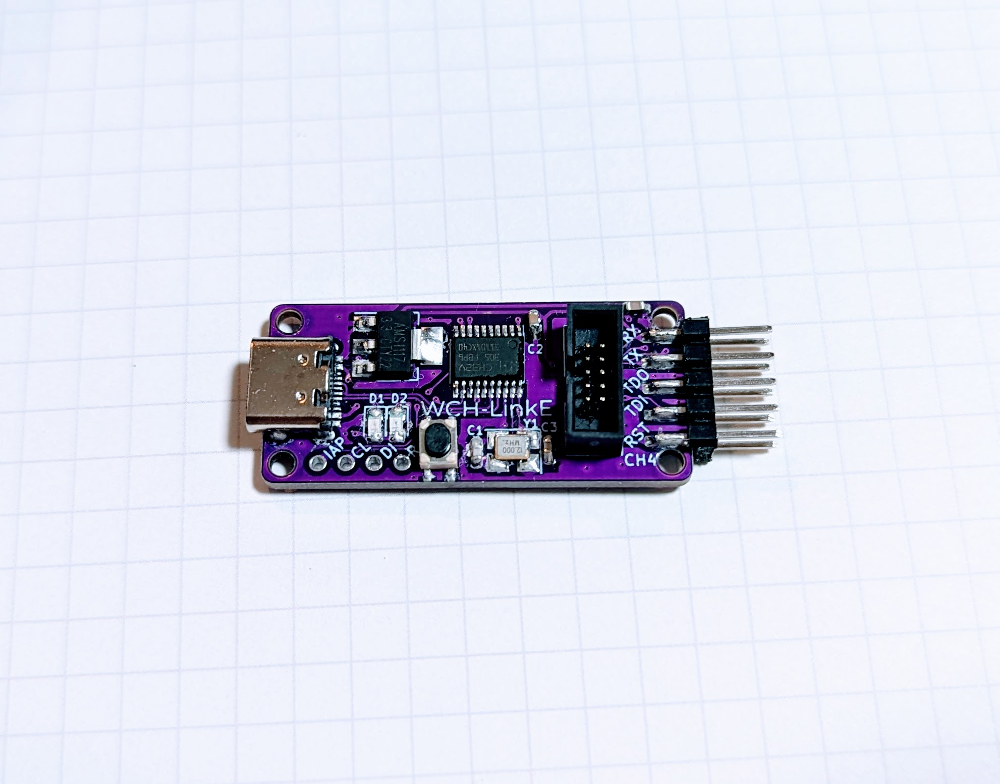
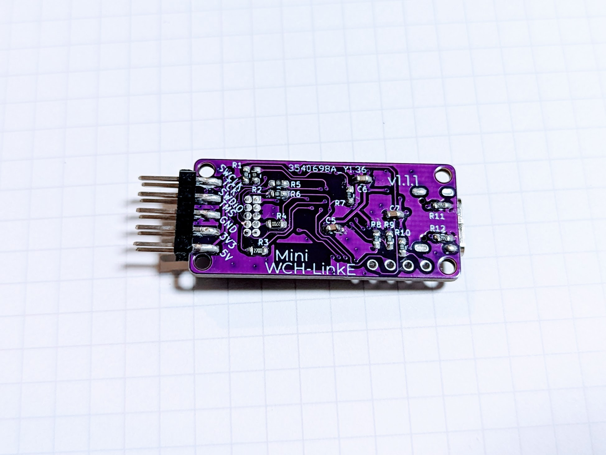
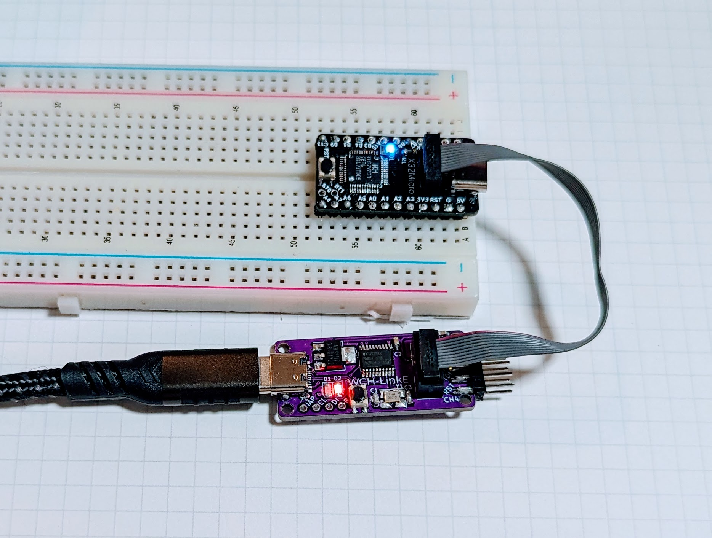
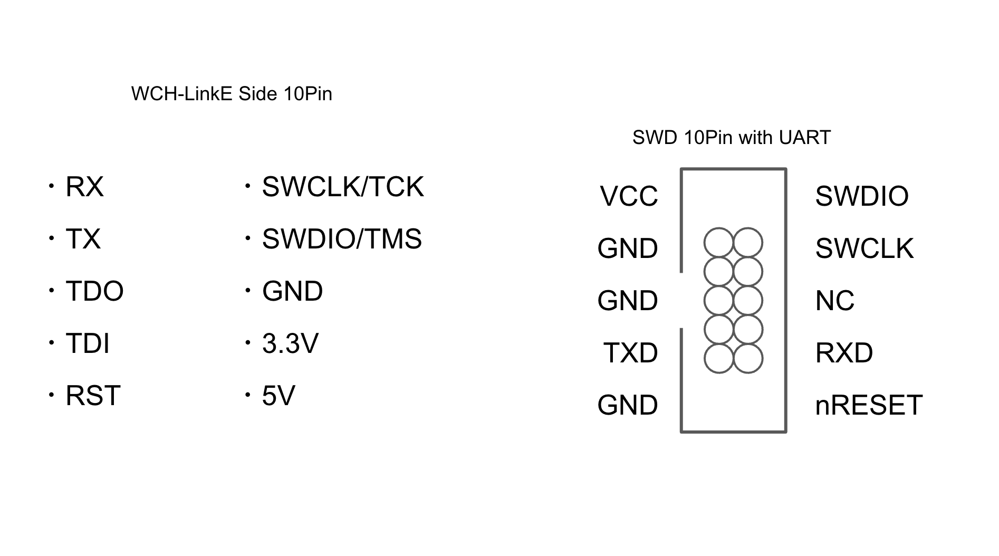

# MINI WCH-LinkE

WCH-LinkE Clone

## Features

- Arduino UNO R4-like SWD with UART 1.26mm 10-pin added. VCC is 3.3V.
- USB Type-C

## Documents

- semantics: [kicanvas](https://kicanvas.org/?github=https%3A%2F%2Fgithub.com%2F74th%2Fmini-wch-linke%2Fblob%2F1.1.1%2Fwch-link.kicad_sch)
- pcb: [kicanvas](https://kicanvas.org/?github=https%3A%2F%2Fgithub.com%2F74th%2Fmini-wch-linke%2Fblob%2F1.1.1%2Fwch-link.kicad_pcb)
